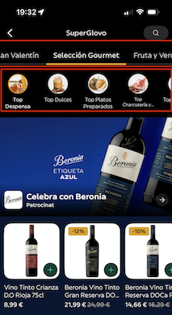

# Analysis of Customer Navigation Using the Tab Bar

## Summary
This analysis answers some questions regarding customer navigation using the Tab Bar. The Tab Bar exists in multiple places, but we will focus on the Tab Bar from the Collections page. The user can change to various SuperCollections using the top box and to various Collections from the selected SuperCollection using the bottom box. When the user changes to another SuperCollection, it will automatically load the first Collection of that SuperCollection.

## Objectives
- Determine the Click-Through Rate (CTR) of Collection and SuperCollection, to understand which asset is used the most.
- Measure the taps per session for Collection and SuperCollection, to understand how many times people interact with this asset.
- Analyze the distribution of Collections opened from the Tab Bar compared to Store View, to see if people use the Navigation Tab Bar or go back to Store View to change.
- Calculate the percentage of users reaching the bottom once a Collection/SuperCollection is opened, to see if it occurs frequently.

## Key Visuals
- 
- From a business perspective, we define the Navigation Tab Bar as shown in this image. However, it is also triggered in other unwanted scenarios.
- 
- Within restaurants, scrolling up and down can inadvertently trigger the Navigation Tab Bar impression. This behavior is unexpected.
- Conversely, this issue does not occur with Groceries. For instance, while accessing Veritas and scrolling up and down, the event did not trigger until I oppened a Collection.

## References
- None
